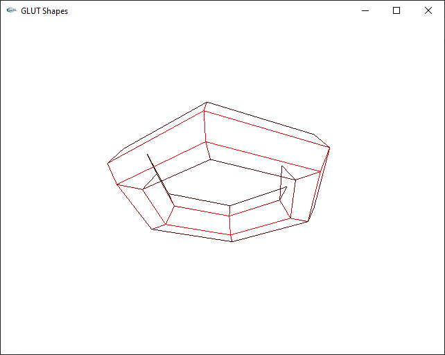

# Mini Project

## Construct a 3D wire frame model with animation (minimum)

## Consist of vertex listing/polygon listing

.png)

- [Live view](https://tahsin000.github.io/COMPUTER-GRAPHICS/11.%20Mini%20Project/assets/2.%20Consist%20of%20vertex%20listingpolygon%20listing/index.html)

## Consider hidden surface

.png)

## Rotate and show the different surface

.png)